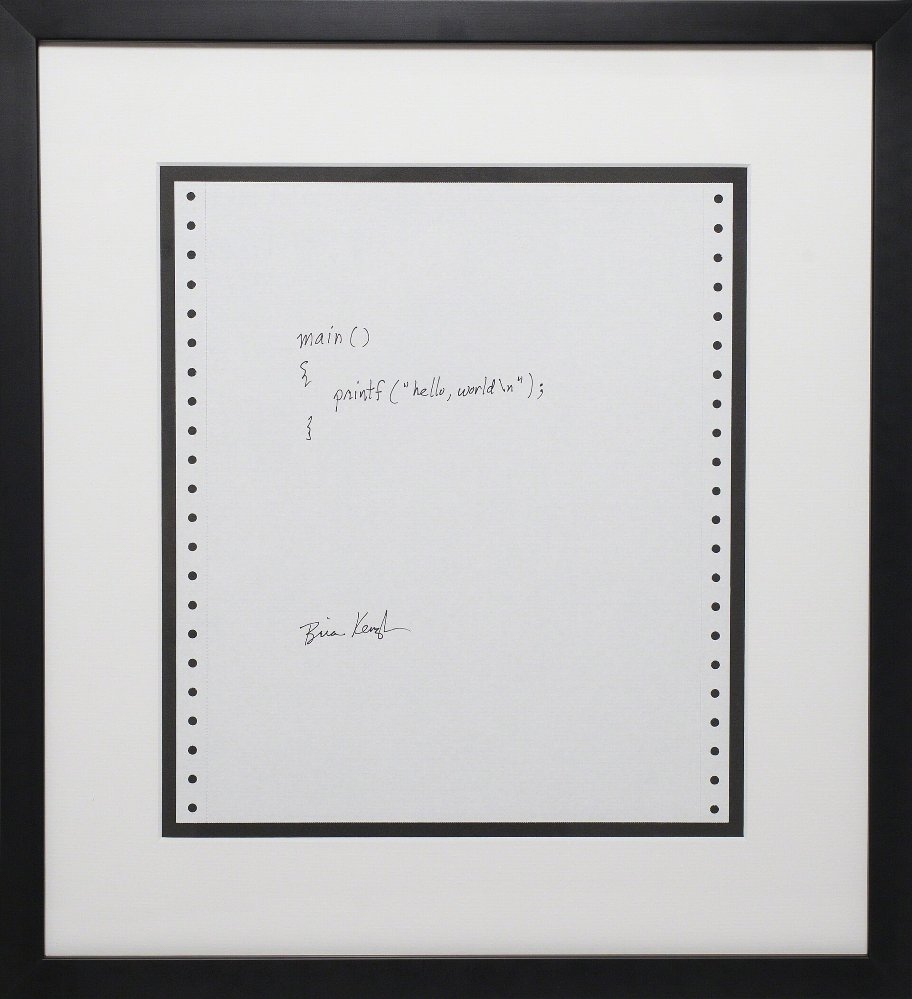

# oi, mundo!

 

> "Hello, World!" — where most programmers' journeys start, and yet another contribution from the minds at Bell Labs.

 

For more, see [Wikipedia page about "Hello, World!"](https://en.wikipedia.org/wiki/%22Hello,_World!%22_program#).